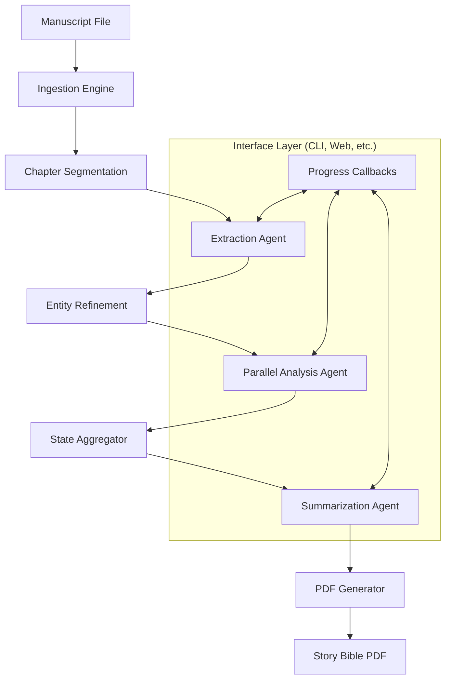

# LoreBinders: Project Technical Breakdown

LoreBinders is an AI-powered core engine designed to transform raw manuscripts into structured, searchable, and professional "Story Bibles." While it includes a CLI for immediate use, the system is architected as an interface-agnostic API, allowing for integration into various frontends via progress hooks and structured state returns.

---

## 1. Project Overview
**LoreBinders** is a pipeline-driven application engine that automates the extraction and analysis of narrative elements (characters, locations, items, etc.) from book manuscripts. It leverages Large Language Models (LLMs) via structured outputs to build a persistent state of a story's world.

### Key Value Propositions:
- **Interface Agnostic:** The core logic is decoupled from the UI, interacting with consumers via a standardized API and callback hooks.
- **Consistency Management:** Ensures authors track character traits and world details across long series.
- **Automated Documentation:** Replaces hours of manual note-taking with a high-fidelity PDF "Story Bible."
- **Cost Efficiency:** Implements a robust caching/storage layer to minimize LLM API costs and handle large-scale processing.

---

## 2. Technical Stack
The project is built on modern Python (3.10+) with a focus on type safety and structured data.

### Core Frameworks & Libraries:
| Component | Library | Purpose |
| :--- | :--- | :--- |
| **AI Orchestration** | `pydantic-ai` | Manages LLM interactions, structured output enforcement, and agent dependencies. |
| **Data Modeling** | `pydantic` (v2) | Defines the "source of truth" for all data structures and state transitions. |
| **Document Parsing** | `ebook2text` | Converts EPUB and PDF manuscripts into clean, segmentable text. |
| **Reporting** | `reportlab` | Programmatically generates the final PDF Story Bible using custom styles. |
| **Optional CLI** | `typer` & `rich` | An example implementation of a consumer interface for the core engine. |
| **Persistence** | `sqlalchemy` | Optional relational database support for storing entity records and analysis. |
| **Configuration** | `pydantic-settings` | Manages environment variables and model configuration. |

---

## 3. High-Level System Design
The system is designed as a **Core Orchestration Engine** that manages a sequential data pipeline.

### The Callback Mechanism:
The core `build_binder` function accepts a `progress` callable. This allows any interface (CLI progress bars, Web sockets, etc.) to receive real-time updates on the pipeline's stage, current task count, and status messages without being tightly coupled to the engine's internal logic.

---

## 4. Low-Level System Design

### A. Core Data Models (`src/lorebinders/models.py`)
State is hierarchical and strictly typed:
- **`Chapter`**: Holds raw content and a list of `EntityProfile` objects.
- **`Binder`**: The root container. It holds `CategoryRecord` objects.
- **`CategoryRecord`**: Maps entity names to `EntityRecord` objects.
- **`EntityRecord`**: Contains a dictionary of `appearances` (mapped by chapter number) and a final narrative `summary`.
- **`EntityAppearance`**: Holds the specific traits extracted for an entity in a specific chapter.

### B. Agent Architecture (`src/lorebinders/agent/`)
The system employs three specialized agents using the **Factory Pattern**:
1. **Extraction Agent**:
   - **Input**: Chapter text + target categories.
   - **Output**: `ExtractionResult` (list of names per category).
   - **Special Logic**: Handles first-person POV by mapping "I/Me" to a provided narrator name.
2. **Analysis Agent**:
   - **Input**: Chapter text + target entity + list of traits to find.
   - **Output**: `AnalysisResult` (traits, values, and the "evidence" snippet from the text).
   - **Parallelization**: This agent is parallelized across chapters using `asyncio` to maximize throughput.
3. **Summarization Agent**:
   - **Input**: A raw dump of all traits and evidence gathered for an entity across all chapters.
   - **Output**: A cohesive, well-written prose summary for the Story Bible.

### C. Refinement Engine (`src/lorebinders/refinement/`)
Post-processing logic to ensure data integrity:
- **Normalization**: Standardizes name casing and removes leading/trailing noise.
- **Deduplication**: Identifies when "Alaric" and "Prince Alaric" refer to the same entity.
- **Trait Cleaning**: Strips common LLM hallucinations or empty values.

### D. Storage Providers (`src/lorebinders/storage/`)
An abstraction layer (`StorageProvider` Protocol) supports multiple backends:
- **`FilesystemStorage`**: Stores data as structured JSON files within a `work/` directory organized by `Author/Title`.
- **`DBStorage`**: Uses SQLAlchemy to store records in a relational database (e.g., SQLite or PostgreSQL).

---

## 5. Detailed Workflow: How it Works

### Step 1: Ingestion
The manuscript is read and stripped of formatting. The system uses regex or structural cues to split the text into a list of `Chapter` objects.

### Step 2: Discovery (Extraction)
The system iterates through chapters. The Extraction Agent scans each chapter for names belonging to categories like "Characters," "Locations," or custom user-defined categories.

### Step 3: Resolution (Refinement)
The raw list of names from all chapters is aggregated. The system performs deduplication and applies "Narrator Logic" (e.g., if the user says the narrator is "John," any mention of "I" in first-person text is assigned to "John").

### Step 4: Deep Dive (Analysis)
The system identifies which chapters each unique entity appears in. For every appearance, the Analysis Agent is called to find traits defined in `Settings` (e.g., Appearance, Role, Personality).

### Step 5: Aggregation
The individual chapter profiles are merged into the `Binder`. The system now knows that "John" appeared in Chapters 1, 5, and 10, with different traits discovered in each.

### Step 6: Synthesis (Summarization)
The Summarization Agent reads the "life history" of the entity (the traits from all chapters) and produces a final summary.

### Step 7: Delivery (Reporting)
The `Binder` is converted into a PDF. The report is organized by category, with a table of contents and detailed entries for every entity including their summary and a table of traits found throughout the book.

---

## 6. Architectural Evolution (Git History Insights)
- **From Dictionaries to Models**: The system migrated from fragile nested dicts to strict Pydantic models to prevent runtime errors.
- **Async Migration**: Added `asyncio` to the Analysis phase, allowing the system to process 50+ chapters simultaneously, reducing runtimes by up to 80%.
- **Resilience**: Implemented `FallbackModel` logic. If a primary model (e.g., DeepSeek) fails due to content filters, the system automatically retries with a secondary model (e.g., a "Flash" model) to ensure the run completes.

---

## 7. Recreation Guide
To recreate this project, follow this implementation order:
1. **Define the Schemas**: Create Pydantic models for the Binder state.
2. **Build the Storage Layer**: Implement a JSON-based file storage system.
3. **Draft the Prompts**: Write system prompts for Extraction, Analysis, and Summarization.
4. **Implement the Agents**: Use `pydantic-ai` to bind the prompts to the schemas.
5. **Write the Orchestrator**: Create the loop that moves data from Ingestion -> Extraction -> Analysis -> Summarization.
6. **Add the Refinement Logic**: Implement the name normalization and deduplication.
7. **Generate the PDF**: Use `reportlab` to map the `Binder` model to a PDF document.
8. **Wrap in a CLI**: Use `typer` to expose the orchestrator to the user.
