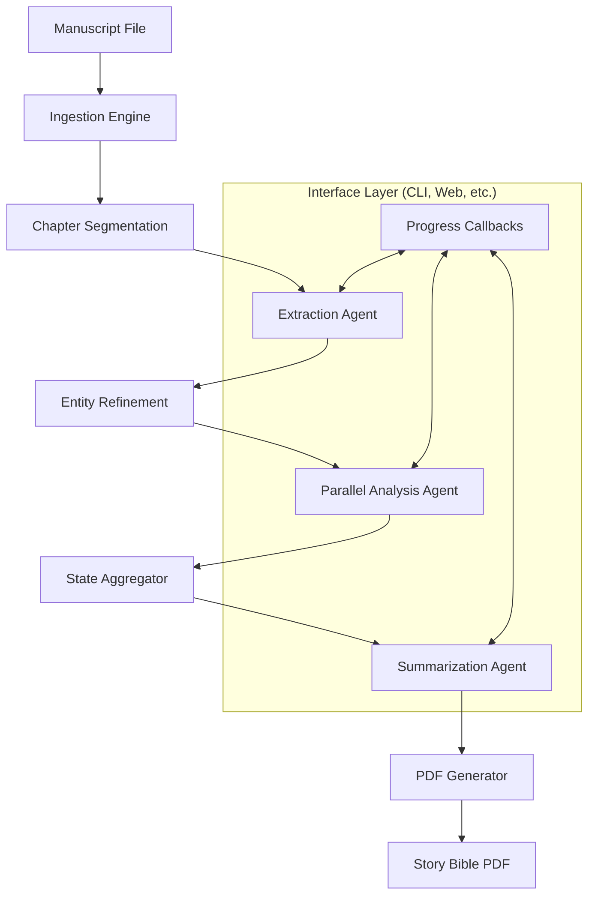

# System Architecture

LoreBinders is a pipeline-driven core engine designed for structured data extraction and narrative synthesis from manuscripts.

## 🏗 High-Level Design

The architecture is built around a sequential data pipeline that processes manuscripts through several stages:

### Callback Mechanism
The system utilizes a progress callable mechanism to decouple the core engine from the user interface. This allows real-time updates for both CLI progress bars and potential web-based status bars.

## 🗂 Data Hierarchy (`src/lorebinders/models.py`)

LoreBinders maintains a strictly typed state hierarchy using Pydantic:

1.  **`Binder`**: The root state container for a single story/book.
2.  **`CategoryRecord`**: Maps a category (e.g., "Characters") to its entities.
3.  **`EntityRecord`**: Represents a single unique entity, containing its collected appearances and final summary.
4.  **`EntityAppearance`**: Holds specific traits and evidence gathered for an entity within a particular chapter.
5.  **`Chapter`**: A single manuscript segment containing raw text and extracted entity profiles.

## 🤖 Agent Architecture (`src/lorebinders/agent/`)

Specialized agents handle specific stages of the pipeline:

- **Extraction Agent**: Scans chapter segments for entity names across defined categories.
- **Analysis Agent**: Performs deep-dive analysis of individual entity appearances to extract specific traits (Appearance, Personality, etc.). This agent is parallelized across chapters for performance.
- **Summarization Agent**: Collates and synthesizes all gathered information for an entity into a final, cohesive narrative.

## 🧹 Refinement Engine (`src/lorebinders/refinement/`)

Post-extraction logic ensures data quality:
- **Normalization**: Standardizes name formats and casing.
- **Deduplication**: Merges aliases and similar entity names.
- **Cleaning**: Removes invalid or hallucinatory data from LLM outputs.

## 💾 Storage Layer (`src/lorebinders/storage/`)

An abstraction layer supports multiple storage backends via the `StorageProvider` Protocol:
- **`FilesystemStorage`**: Stores data as structured JSON files in the `work/` directory.
- **`DBStorage`**: Optional relational database support (SQLite, PostgreSQL) via SQLAlchemy.
